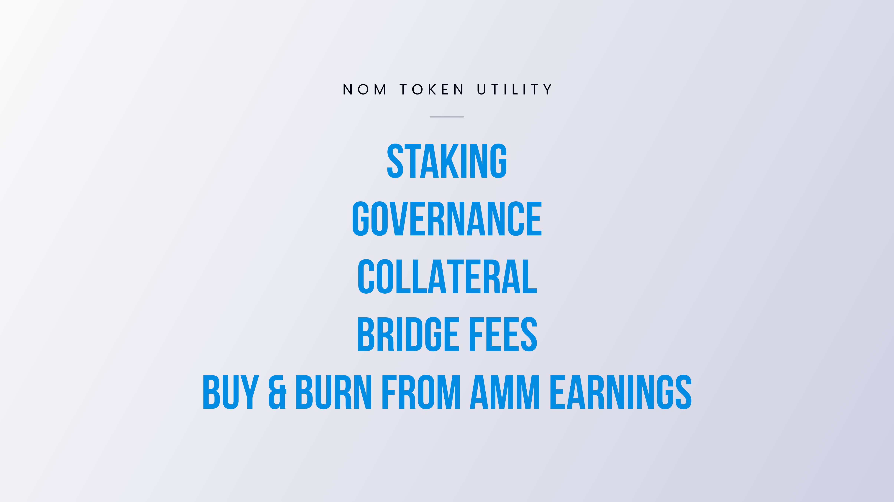

# Utility of NOM

**NOM** is Onomy Protocol's native coin that provides users with significant utility across Onomy Network's ecosystem of applications.

## Staking&#x20;

When NOM holders delegate their NOM to a validator, they are _**staking.**_ Staking provides rewards in return for delegating to validators who support the security and operations of a blockchain network. Read more about [NOM staking rewards](../validators-staking/incentives-and-staking-rewards.md)**.**

## Governance&#x20;

Onomy will be governed by the Onomy DAO**,** providing NOM holders with the opportunity to guide the decision-making process through NOM-weighed votes. Read more about [Governance](../governance/overview.md).\
\
A DAO (Decentralized Autonomous Organization) is an organization represented by rules encoded as a transparent computer program, controlled by the organization members, and not influenced by a central government. As the rules are embedded into the code, no managers are needed, thus removing any bureaucracy or hierarchy hurdles.\
\
Onomy has taken this a step further by integrating new functionality to the governance module of the Cosmos SDK. A DAO Wallet has been created to hold the entire protocol treasury of funds, further decentralizing management and enabling NOM token holders to participate meaningfully in not only the direction of Onomy - but its use of funds as well. In doing so, Onomy creates a truly decentralized and "on-chain" Foundation governed by NOM holders.

## Collateral

NOM is a collateral type to Onomy's Denom stablecoins. Upon locking the token into the Onomy Reserve, users may easily mint Denoms pegged to the world’s major currencies.

## **Bridge Fees**

The [Arc Bridge Hub](../app-ecosystem/arc-bridge-hub.md) requires users to pay for their bridge transaction in NOM.

## **Buy & Burn from AMM Earnings**

The Onomy Exchange's AMM earnings are dispersed in two ways. Firstly, to pay the respective portion of AMM earnings to liquidity providers. Second, to programmatically purchase NOM and then burn the purchased NOM from the supply. This is done with no management by any central party, nor the DAO.\
\
This functionality is incentivized by providing a programmatic reward to any user who executes the buy and burn function - thus decentralizing this action and creating a competitive market amongst users to execute the function to receive the reward.&#x20;

## $NOM Tokenomics 

The Onomy Network has a genesis supply of 100M NOM, distributed as such:

* 45% in on-chain Treasury managed by DAO
* 20% Ecosystem to support market makers, validators, exchange listings, incentives, and more
* 20% to Early Backers and Partners
* 15% Team and Advisory

Backer, team, and advisor tokens are vested for 24–36 months linearly each month, with a 12 month cliff. DAO treasury tokens are only usable following successful DAO governance votes, with the system programmatically funding proposals when approved, with no central key management by any Onomy contributor.

The $NOM supply will increase from [inflationary rewards](https://docs.onomy.io/validators-staking/incentives-and-staking-rewards) and bridges from the [bonding curve](https://docs.onomy.io/nom-distribution/bonding-curve-offering).
