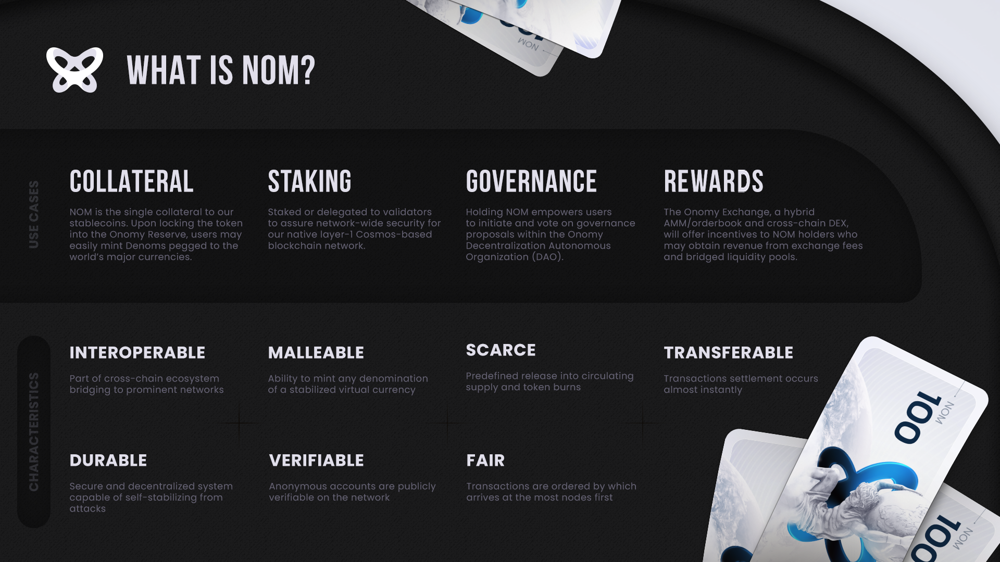

# What Is NOM?

**NOM** is Onomy Protocol's native coin that provides users with significant utility across Onomy Network's ecosystem of applications.

## Staking&#x20;

NOM is staked or delegated to validators to assure network-wide security for Onomy's native layer-1 Cosmos-based blockchain network, unlocking rewards for those that help secure the network.

The primary network security of the ONET is assured by a Proof of Stake model that bonds NOM to validators either by the validators themselves or through delegation. Network security depends on the bonding to create both incentives for good behavior and disincentives for bad behavior. Staked NOM may not be used to mint new Denoms while staked, but will receive the staking rewards, up to 100% yearly depending on the amount of NOM staked.&#x20;

Read more about [Staking and Validator Concepts](../validators/PoS-Staking.md)

## Collateral

NOM is the single collateral to Onomy's Denom stablecoins. Upon locking the token into the Onomy Reserve, users may easily mint Denoms pegged to the world’s major currencies.

### Properties of NOM as Perfect Collateral

* **Malleable:** Ability to mint any denomination of a stabilized virtual currency
* **Scarce:** Predefined release into circulating supply and burning of supply
* **Transferable:** Transactions on the Onomy Network finalize near instantaneously
* **Durable:** Secure decentralized system capable of self-stabilizing from attacks
* **Verifiable:** Anonymous accounts are publicly verifiable on the network
* **Fair:** Transactions are ordered by which arrives at the most nodes first

## Governance&#x20;

DAO (Decentralized Autonomous Organization) is an organization represented by rules encoded as a transparent computer program, controlled by the organization members, and not influenced by a central government. As the rules are embedded into the code, no managers are needed, thus removing any bureaucracy or hierarchy hurdles.

Onomy will be governed by the Onomy DAO**, providing NOM holders with the opportunity to guide the decision-making process through NOM-weighed votes**.&#x20;

#### Read more about [Governance](../governance/overview.md)

## **AMM Keeper Bots**

**NOM** is programatically purchased and removed from supply by Keeper bots observing AMM liquidity pool rewards from the Onomy Exhange (ONEX). This provides perpetually growing deflationary pressure on **NOM** as exchange volumes grow.

_Additional documentation to come_


_**DISCLAIMER AND NOTES:** By reading or accessing this documentation in any way you automatically acknowledge having read, understood and accepted any other published and related materials as well. For the avoidance of any doubt, Onomy including but not limited to the overall project, the website, all its software including any smart contracts and apps (“Onomy Platform”) as presented in these documents is a decentralised digital token management platform and it is not (not it is required to be) an actively licensed or regulated or exempted financial, or payment or digital asset service or VASP of any kind and in any jurisdiction. Any terminology used in this documentation, or in general in the Onomy Platform is intended only as a basic reference, without any effective or legal meaning of the same terms in a regulated financial environment, and/or any other regulated framework including but not limited to e-money or payment services. The NOM token is a strictly utility token in any jurisdiction and is not and can not be considered as a security or otherwise a regulated token of any kind, is not in any way e-money and/or a fiat or an asset backed stablecoin, whether global or limited in scope. This document taken by itself is not, nor it can be construed as a contract, an investment contract or a contractual agreement of any kind, it is not an invitation or offer to invest in Onomy or acquire or use its token in any way with any expectation of future profit. Any user of the Onomy Platform declares to have received appropriate technical, administrative, tax and legal advice before and after reading this documentation, the website and using any part of the Onomy Platform (including any tokens therein) and accepts that there is an inherent high risk in acquiring or using any kind of blockchain and/or crypto token, platform, software, interface and acknowledges with full disclaimer for any of the persons or entities mentioned within this documentation or in any way directly or indirectly connected to the Onomy Platform, that there can be any kind of damage suffered, including total loss._

